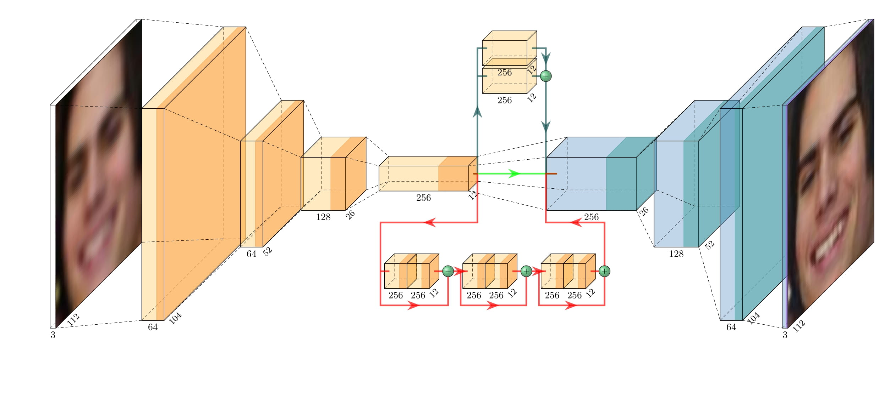

# Image denoising of highly obfuscated human faces

    

## Authors

* [**Rinaldi Luca**](https://github.com/RinaldiLuca) (University of Padua)
* [**Giunta Marco**](https://github.com/marco-giunta) (University of Bologna)

## Abstract
We analyzed the application of the Convolutional Autoencoder architecture to the task of denoising images of highly obfuscated human faces images. 
In particular we trained several variations of this architecture to accept as input images from the Labeled Faces in the Wild, which we corrupted via Gaussian blur and pixelation. 
We compare performance across different architectures using a variety of different metrics (PSNR, SSIM, human aesthetics perception). 
Finally we explore the role of the loss function by training with some loss functions common in the literature (pixel loss, perceptual loss, and a weighted superposition of the two). 
In the end we obtain that all variations of the CAE architecture are able to effectively reconstruct highly obfuscated faces with a quick training consisting of only a few epochs, which can be further reduced by using the perceptual/mixed loss.

* The complete report of this project can be found [**here**](https://github.com/RinaldiLuca/image-denoising/blob/main/Report.pdf)
